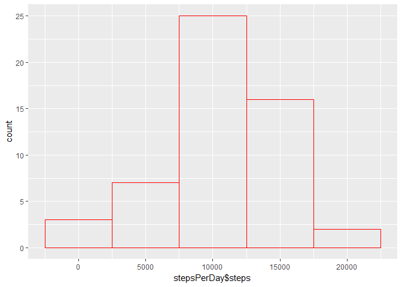

## Loading and preprocessing the data
1) Load the data (i.e. read.csv())

```r
activity <- read.csv("activity.csv")
```
2) Process/transform the data (if necessary) into a format suitable for your analysis

```r
stepsPerDay <- aggregate(steps~date, data=activity, FUN=sum)
```

## What is mean total number of steps taken per day?

```r
library(ggplot2)
```

```
## Warning: package 'ggplot2' was built under R version 3.4.4
```

```r
plot <- ggplot(data=stepsPerDay, aes(stepsPerDay$steps))
plot <- plot + geom_histogram(binwidth=5000, color = 'red', fill = NA)
print(plot)
```

<!-- -->

3. Calculate the mean/median

The mean of the steps is:

```r
mean(stepsPerDay$steps)
```

```
## [1] 10766.19
```
The media of the steps is:

```r
median(stepsPerDay$steps)
```

```
## [1] 10765
```

## What is the average daily activity pattern?
1) Make a time series plot (i.e. \color{red}{\verb|type = "l"|}type="l") of the 5-minute interval (x-axis) and the average number of steps taken, averaged across all days (y-axis)

```r
intervals <- aggregate(steps~interval, data=activity, FUN=mean)

library(ggplot2)
plot <- ggplot(data=intervals, aes(x=interval, y=steps))
plot <- plot + geom_line(color = 'red')
plot <- plot + labs(x="Time Interval", y="Steps", title="Steps over Time")
print(plot)
```

<!-- -->

2. Which 5-minute interval, on average across all the days in the dataset, contains the maximum number of steps?

```r
max <- which.max(intervals$steps)
intervals[max, ]$interval
```

```
## [1] 835
```

The 835th interval

## Inputing missing values
1. Calculate and report the total number of missing values in the dataset (i.e. the total number of rows with \color{red}{\verb|NA|}NAs)

```r
sum(is.na(activity$steps))
```

```
## [1] 2304
```
There are 2304 NA items

2. Devise a strategy for filling in all of the missing values in the dataset. The strategy does not need to be sophisticated. For example, you could use the mean/median for that day, or the mean for that 5-minute interval, etc.

Fill the NAs with the average for that interval. We can use the intervals variable since it is already populated with the mean

3. Create a new dataset that is equal to the original dataset but with the missing data filled in.

```r
newActivity <- activity
for (idx in 1:nrow(newActivity)) {
  if (is.na(newActivity[idx,]$steps)) {
    naInterval <- newActivity[idx,]$interval
    newActivity[idx,]$steps <- intervals[intervals$interval == naInterval,]$steps
  }
}
```

4. Make a histogram of the total number of steps taken each day and Calculate and report the mean and median total number of steps taken per day. Do these values differ from the estimates from the first part of the assignment? What is the impact of imputing missing data on the estimates of the total daily number of steps?


```r
stepsPerDay <- aggregate(steps~date, data=newActivity, FUN=sum)
library(ggplot2)
plot <- ggplot(data=stepsPerDay, aes(stepsPerDay$steps))
plot <- plot + geom_histogram(binwidth=5000, color = 'red', fill = NA)
print(plot)
```

<!-- -->

The mean steps per day with the NAs filled in:

```r
mean(stepsPerDay$steps)
```

```
## [1] 10766.19
```

The median steps per day with the NAs filled in:

```r
median(stepsPerDay$steps)
```

```
## [1] 10766.19
```

The mean is still the same since we used the mean as the fill-in value. The median is different because there are more values used in calculating.

## Are there differences in activity patterns between weekdays and weekends?

Add the weekdays to the data table so we can filter on them:

```r
newActivity$dayOfWeek <- weekdays(as.Date(newActivity$date))
isWeekend <- function(day) {
  if (day %in% c("Saturday", "Sunday")) {
    return("weekend")
  }
  return("weekday")
}
newActivity$daytype <- apply(as.matrix(newActivity$dayOfWeek), 1, isWeekend)
newActivity$daytype <- factor(newActivity$daytype)
```

Plot it:

```r
intervals <- aggregate(steps~interval+daytype, data=newActivity, FUN=mean)

library(ggplot2)
plot <- ggplot(data=intervals, aes(x=interval, y=steps))
plot <- plot + geom_line(color = 'red')
plot <- plot + facet_grid(~daytype)
plot <- plot + labs(x="Time Interval", y="Steps", title="Steps over Time")
print(plot)
```

<!-- -->
